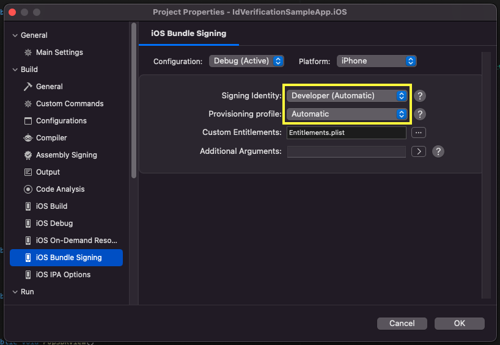
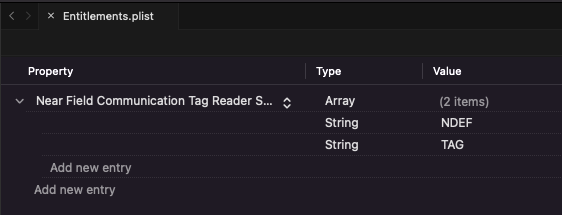
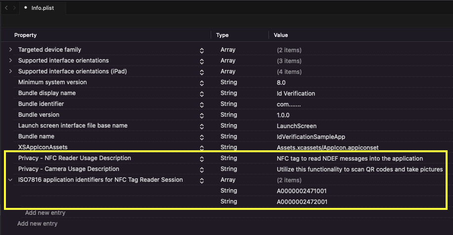

# 365id Id Verification Xamarin SDK

The 365id Id Verification SDK enables you to integrate 365id services into your Xamarin app.  

The SDK supports identifying and validating ID documents such as passports, ID cards and drivers' licenses, as well as reading the text on the document and automatically mapping these to relevant fields when used in conjunction with the [365id Integration Service](https://365id.com/integrations/?lang=en).

<br/>
<br/>
<br/>

## Registration
If you are already a customer of 365id then you can request SDK credentials by contacting 365id's support at [support@365id.com](mailto:support@365id.com).

Otherwise, you can contact us at [info@365id.com](mailto:info@365id.com) for further information.

<br/>
<br/>
<br/>

## Native SDKs
For more information about the SDK's integration, system flows, validation of result and production implementation you can check in:
- https://github.com/365id-AB/idverification-ios
- https://github.com/365id-AB/idverification-android

<br/>
<br/>
<br/>

## Requirements
- Visual Studio with Xamarin installed
- Xamarin.iOS version 14.0 and above
- Xamarin.Android API level 24 (Android 7.0) and above
- Android compilation target 33 (Android 13.0) and above

<br/>
<br/>
<br/>

## NuGet packages
The 365id Id Verification SDK is distributed as NuGet packages.
- Android SDK: [IdVerification.Xamarin.Android.SDK](https://www.nuget.org/packages/IdVerification.Xamarin.Android.SDK)
- iOS SDK: [IdVerification.Xamarin.iOS.SDK](https://www.nuget.org/packages/IdVerification.Xamarin.iOS.SDK)

<br/>
<br/>
<br/>

## Project setup

### Android project setup
Install our [IdVerification.Xamarin.Android.SDK](https://www.nuget.org/packages/IdVerification.Xamarin.Android.SDK) in your Xamarin.Android project.

### iOS project setup
Install our [IdVerification.Xamarin.iOS.SDK](https://www.nuget.org/packages/IdVerification.Xamarin.iOS.SDK) in your Xamarin.iOS project.

#### Add the NFC capability

The 365id Id Verification SDK uses NFC reading technology to verify the contents of chips present in id documents. In order for this to work, this needs to be added to the integrating application as a capability:

1. Set your provisioning profile to support Near Field Communication Tag Reading. You do this on the Apple developer webpage. 

2. Open the project's options, on iOS Bundle Signing, and select your identity and the provisioning profile created in the previous step.



3. Remove the NDEF entitlement.
> **:exclamation: NOTICE:** if the NDEF entitlement is not removed there can be issues when releasing to the AppStore. 



<br/>
<br/>
<br/>  

#### Add the target properties

Add a `bundle display name` and `bundle identifier` to your info.plist

Add a `NSCameraUsageDescription` entry to your app's info.plist, with the reason why your app requires camera access (e.g. “Allow access to camera to scan ID document.”)

Add a `NFCReaderUsageDescription` entry to your app's info.plist, with the reason why your app requires NFC access (e.g. “Allow access to NFC to read the e-passports.”)

Add a `NFC tag type description` to your info.plist

Example:   ISO7816 application identifiers for NFC Tag Reader Session (A0000002471001 and A0000002472001) 
```xml
   <key>com.apple.developer.nfc.readersession.iso7816.select-identifiers</key>
   <array>
      <string>A0000002471001</string>
      <string>A0000002472001</string>
   </array>
```



<br/>
<br/>
<br/>

### Sample Application

Please note that there is a [Sample Application](/IdVerificationSampleApp/IdVerificationSampleApp.sln) written in C# using Xamarin.Forms that demonstrates how the SDK can be used, available in this repository.

<br/>
<br/>
<br/>

## Get started

In order to use the 365id Id Verification SDK it is necessary to follow the steps below.

### Retrieve a token
Before being able to use the 365id Id Verification SDK, you will need an access token and to get that you will need to make a Rest API call with your client id and secret. If you don't have the credentials, please contact us at [info@365id.com](mailto:info@365id.com). Once you have received the credentials you will be able to request an access token. If the access token has expired you don't have to request a new one, all you have to do is refresh it using the refresh_token endpoint.

**Url**: https://eu.customer.365id.com

---
#### **/api/v1/access_token**  
*Used for retrieving a new access token using the client id and secret, also known as customer external id and license key*  

POST  
Request  

*Body - application/json*
```json
{
  "client_id": "string",
  "client_secret": "string"
}
```  
Response
| Code | Description |
| ---- | ----------- |
| 200 | Success |  
  
*Body - application/json*
```json
{
  "access_token": "string",
  "token_type": "string",
  "expires_in": 0,
  "refresh_token": "string",
  "scope": "string"
}
```
| Code | Description |
| ---- | ----------- |
| 400 | Bad Request |  
  
*Body - application/json*
```json
{
  "error": "string",
  "error_description": "string"
}
```
----  

#### **/api/v1/refresh_token**  
*Used for refreshing an already retrieved access token. The access token can be or almost be expired when making this call*

POST  
Request  

*Header*
| Key | Value |
| ----| ----- |
| Authorization | Bearer \<access_token\> |  
  
*Body - application/json*
```json
{
  "refresh_token": "string"
}
```
  
Response  
| Code | Description |
| ---- | ----------- |
| 200 | Success |  
  
*Body - application/json*
```json
{
  "access_token": "string",
  "token_type": "string",
  "expires_in": 0,
  "refresh_token": "string",
  "scope": "string"
}
```

| Code | Description |
| ---- | ----------- |
| 400 | Bad Request |  
  
*Body - application/json*
```json
{
  "error": "string",
  "error_description": "string"
}
```
---  

The access token is valid for a certain amount of time, after that you will have to refresh the access token using the provided refresh token

> **⚠️ SECURITY NOTICE:**  In a production app, it is recommended that you obtain the JWT token using a server-to-server call. The example app retrieves it directly for the sake of simplicity.  

<br/>
<br/>

### Call the SDK on Xamarin.Android

When you in your app have the access token, you are ready to call the `StartSdk()` function, supplying the access token as part of the device information required as a parameter. Besides the `device information` you also need to provide a callback function.

### The Callback on Xamarin.Android

An example callback solution can be seen in the Sample App.  
The callback function takes a `TransactionResult` object as its only parameter. The `TransactionResult`contains the transaction id and status of the id verification transaction.  

An example of how the callback and the `TransactionResult` can be used can be seen in the [SampleApp](/IdVerificationSampleApp/IdVerificationSampleApp/IdVerificationSampleApp.Android/Services/IdVerificationService.cs).

> **:exclamation: NOTICE:** It is important that you call the `StopSdk()` in the callback, to clear up allocated resources.

> **:exclamation: NOTICE:** In order to return to the host apps view, you will have to dismiss Sdk view.

<br/>

### Launch the SDK View on Xamarin.Android

After starting the SDK by making a call to `StartSdk()` and supplying `deviceInfo` which is a string to string dictionary and the callback function. You should switch to the `GetView()`.

An example of how the `GetView()` can be used can be seen in the [SampleApp](/IdVerificationSampleApp/IdVerificationSampleApp/IdVerificationSampleApp.Android/Services/IdVerificationService.cs).

<br/>

### Call the SendIntentToSDK function
Override the `onNewIntent()` method on your `MainActivity` to add support for sending intents to the SDK.

An example of how the `SendIntentToSDK()` can be used can be seen in the [SampleApp](/IdVerificationSampleApp/IdVerificationSampleApp/IdVerificationSampleApp.Android/MainActivity.cs).

<br/>

### Call the SDK on Xamarin.iOS

When you in your app have the access token, you are ready to call the `StartWithDeviceInfo()` function, supplying the access token as part of the device information required as a parameter. Besides the `device information` you also need to provide a callback function.

### The Callback on Xamarin.iOS

An example callback solution can be seen in the Sample App.  
The callback function takes a `TransactionResult` object as its only parameter. The `TransactionResult`contains the transaction id and status of the id verification transaction.  

An example of how the callback and the `TransactionResult` can be used can be seen in the [SampleApp](/IdVerificationSampleApp/IdVerificationSampleApp/IdVerificationSampleApp.iOS/Services/IdVerificationService.cs).

> **:exclamation: NOTICE:** It is important that you call the `Stop()` in the callback, to clear up allocated resources.

> **:exclamation: NOTICE:** In order to return to the host apps view, you will have to dismiss Sdk view.

<br/>

### Launch the SDK View on Xamarin.iOS

After starting the SDK by making a call to `StartWithDeviceInfo()` and supplying `deviceInfo` which is a string to string dictionary and the callback function. You should switch to the `CreateMainViewWithShowAppBar()`.

An example of how the `CreateMainViewWithShowAppBar()` can be used can be seen in the [SampleApp](/IdVerificationSampleApp/IdVerificationSampleApp/IdVerificationSampleApp.iOS/Services/IdVerificationService.cs).

<br/>

## Run the SampleApp project

1. Ensure that you have Xamarin Forms installed in your Visual Studio.

1. Open `IdVerificationSampleApp.sln`.

1. Add your `ClientId`, `ClientSecret`, `LocationName` and `LocationId` to [Constants.cs](/sIdVerificationSampleApp/IdVerificationSampleApp/IdVerificationSampleApp/Utils).  
You can obtain these credentials from the [support@365id.com](mailto:support@365id.com).

4. You should now be able to build and run the Xamarin.Android project and also the Xamarin.iOS project. Please note that you need to run the 365id SDK on a physical device; it will not work in the simulator.

> **⚠️ SECURITY NOTICE:**  The Sample App uses the sdk credentials to directly fetch the access token from the 365id Backend. This is inherently insecure. `This is only done in the purpose of demonstration.` We strongly recommend for a production environment to perform this step with a server-to-server call.

<br/>
<br/>
<br/>

## Help & support

For additional help, please contact support@365id.com.